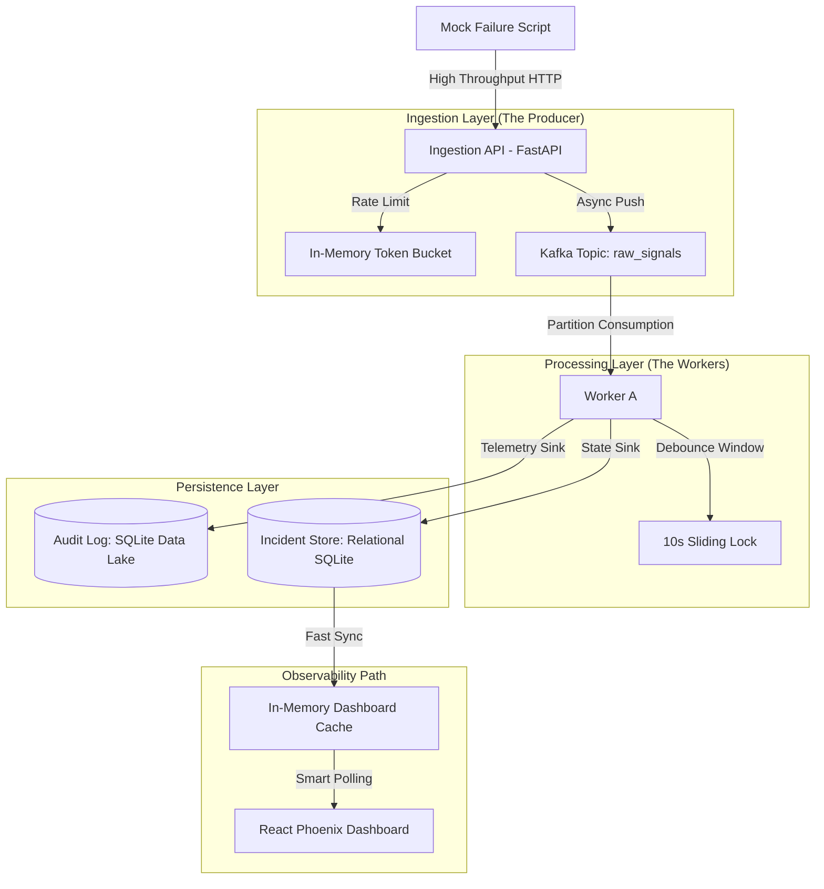

# 🛡️ Mission-Critical Incident Management System (IMS)

[](https://react.dev/)
[](https://fastapi.tiangolo.com/)
[](https://kafka.apache.org/)
[](https://www.docker.com/)

**Incident Management System (IMS)** is a high-performance, resilient incident management engine designed for Site Reliability Engineering (SRE) teams. It is built to handle massive signal bursts (up to 10,000 signals/sec), apply intelligent debouncing, and enforce a strict, accountable incident lifecycle.

---

## 🏗️ Technical Architecture

This system follows a decoupled, event-driven architecture to ensure zero data loss during traffic spikes and seamless scalability.



---

## 🚀 Key Features

### 💎 Exclusive Additional Features (Implemented)
Beyond the standard requirements, this system includes professional-grade enhancements:

*   **🏆 IMS Dashboard UI**: A clean, high-contrast light-themed dashboard designed for clarity during high-stress outages.
*   **⏱️ Mean Time To Repair (MTTR) Engine**: Automatically calculates and seals MTTR metrics upon incident closure for SLA tracking.
*   **📂 Telemetry Data Lake**: Every raw JSON signal is persisted in an audit log, allowing SREs to drill down into the exact payloads that triggered an incident.
*   **⚡ In-Memory Dashboard Cache**: The backend implements a background refresh cycle to ensure dashboard queries are served in sub-millisecond time.
*   **🔄 Resilient Worker Handshake**: Automated connection-retry loops for the Kafka consumer ensure the system recovers gracefully from infrastructure restarts.
*   **🛡️ Advanced RCA Protocol**: Mandatory Root Cause Analysis (RCA) with failure vector categorization and prevention tracking.

### Core IMS Functionality
*   **Backpressure Handling**: Kafka acts as a durable buffer, protecting the database from "Signal Storms" during cascading failures.
*   **Intelligent Debouncing**: A 10-second sliding window deduplicates 1,000s of identical signals into a single actionable incident.
*   **Strategy-Based Alerting**: Dynamic alerting logic (P0-P3) mapped to severity levels using the **Strategy Pattern**.
*   **Lifecycle Enforcement**: Strict state transitions (`OPEN` → `INVESTIGATING` → `RESOLVED` → `CLOSED`) powered by the **State Design Pattern**.

---

## 🛠️ Design Patterns & Resilience

### 1. Strategy Pattern (Alerting Logic)
Allows the system to swap alerting behavior at runtime without modifying core logic.
*   `P0AlertStrategy`: Triggers critical paths (PagerDuty/Twilio mock).
*   `P1-P3Strategies`: Scaled notification levels.

### 2. State Pattern (Lifecycle Management)
Ensures incidents cannot be "accidentally" closed without an RCA. The system programmatically validates the state transition logic within the domain layer.

### 3. Sliding Window Debouncing
Prevents alert fatigue by locking a component ID for 10 seconds. Subsequent signals update the "Last Seen" timestamp and append to the audit log rather than creating duplicate work items.

---

## 🌟 Bonus: Non-Functional Additions

To elevate this project to production-grade standards, the following non-functional enhancements were implemented:

*   **Security & DDoS Protection (Rate Limiting)**: An in-memory token-bucket algorithm is implemented in the FastAPI ingestion layer (`backend/ingestion/api.py`). It restricts clients to 1,000 requests per IP per second, preventing malicious actors or runaway scripts from causing cascading failures.
*   **Performance (Read-Path Caching)**: To prevent the React UI from overwhelming the database with polling queries, the backend uses a background coroutine (`monitor_throughput` in `main.py`) to sync incidents to an in-memory `dashboard_cache` every 5 seconds. The `/incidents` endpoint returns this cache, unlocking sub-millisecond response times.
*   **Resilience (Backpressure Management)**: Apache Kafka is placed between the high-throughput ingestion API and the database worker. This protects the SQLite database from disk write storms, ensuring 10k/sec burst tolerance without memory exhaustion.
*   **Automated Worker Recovery**: The Kafka worker script (`consumer.py`) includes a robust `try-except` retry loop during initialization. If Kafka or Zookeeper takes longer to boot, the worker gracefully sleeps and retries rather than crashing permanently.
*   **Observability**: A `/health` endpoint is available for orchestrators, and throughput metrics (signals/sec) are dynamically calculated and printed to the console.

---

## 🚦 Quick Start & Setup

### 1. Clone & Start the Environment
```bash
# Clone the repository
git clone git@github.com:LunaAlbatross/Incident-Management-System.git
cd Incident-Management-System

# Start the stack
sudo docker-compose up --build -d
```

### 2. Access the Services
*   **React Dashboard**: [http://localhost:5173](http://localhost:5173)
*   **Backend API**: [http://localhost:8000/docs](http://localhost:8000/docs)
*   **Kafka Management**: [http://localhost:8080](http://localhost:8080)

### 3. Simulate a Cascading Failure
Run the provided simulation script to hammer the system with 1,000s of signals and watch the debouncing logic in action:
```bash
python mock_failure.py
```

---

## 📊 Verification Checklist
- [x] **Zero Data Loss**: Check the "Raw Telemetry" table in the UI to see every signal received.
- [x] **Deduplication**: Verify that multiple signals from the same component create only one Incident.
- [x] **Lifecycle Control**: Try closing an incident without an RCA (the system will block it).
- [x] **MTTR Calculation**: Resolve and Close an incident to see the performance metrics.

---

<p align="center">
  Built for Resilience. Engineered for SREs.
</p>
